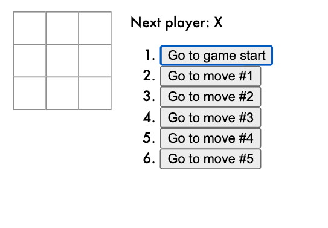

## First react tutorial from https://reactjs.org/tutorial/tutorial.html

Basic tutorial to build a tic-tac-toe game with "time travel" capabilities.
First steps into React.

This project was bootstrapped with [Create React App](https://github.com/facebook/create-react-app).

## Available Scripts

In the project directory, you can run:

### `yarn start`

Runs the app in the development mode. 
Open [http://localhost:3000](http://localhost:3000) to view it in the browser.

The page will reload if you make edits. 
You will also see any lint errors in the console.

### `yarn build`

Builds the app for production to the `build` folder. 
It correctly bundles React in production mode and optimizes the build for the best performance.

The build is minified and the filenames include the hashes. 
Your app is ready to be deployed!

See the section about [deployment](https://facebook.github.io/create-react-app/docs/deployment) for more information.

## Author

👤 ***Carlos Anriquez***

- Github: [@canriquez](https://github.com/canriquez)
- Twitter: [@cranriquez](https://twitter.com/cranriquez)
- Linkedin: [linkedin](https://www.linkedin.com/in/carlosanriquez/)
- Portfolio: [carlosanriquez.com](https://www.carlosanriquez.com)

## 🤝 Contributing

Contributions, issues, and feature requests are welcome!

Feel free to check the [issues page](issues/).

## Show your support

Give a ⭐️ if you like this project!

## Acknowledgments

- Family, always my family.
- The Beagles!

## 📝 License

This project is [MIT](./LICENSE) licensed.